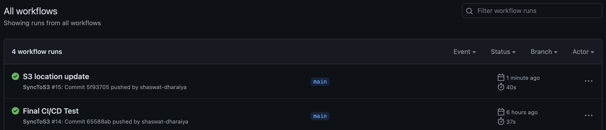
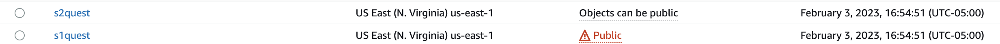
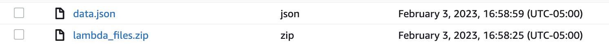
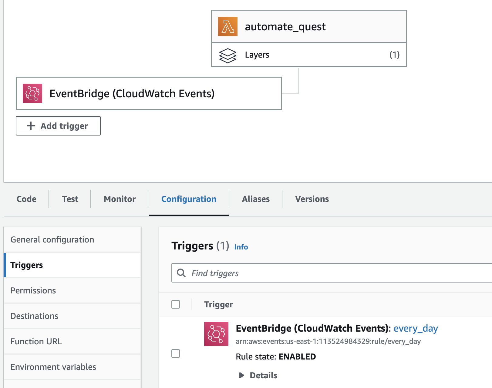
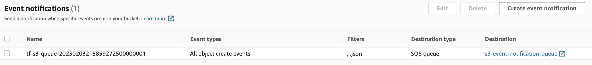
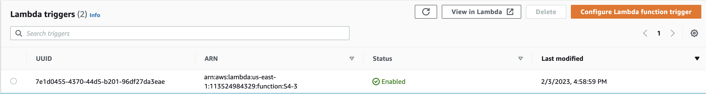
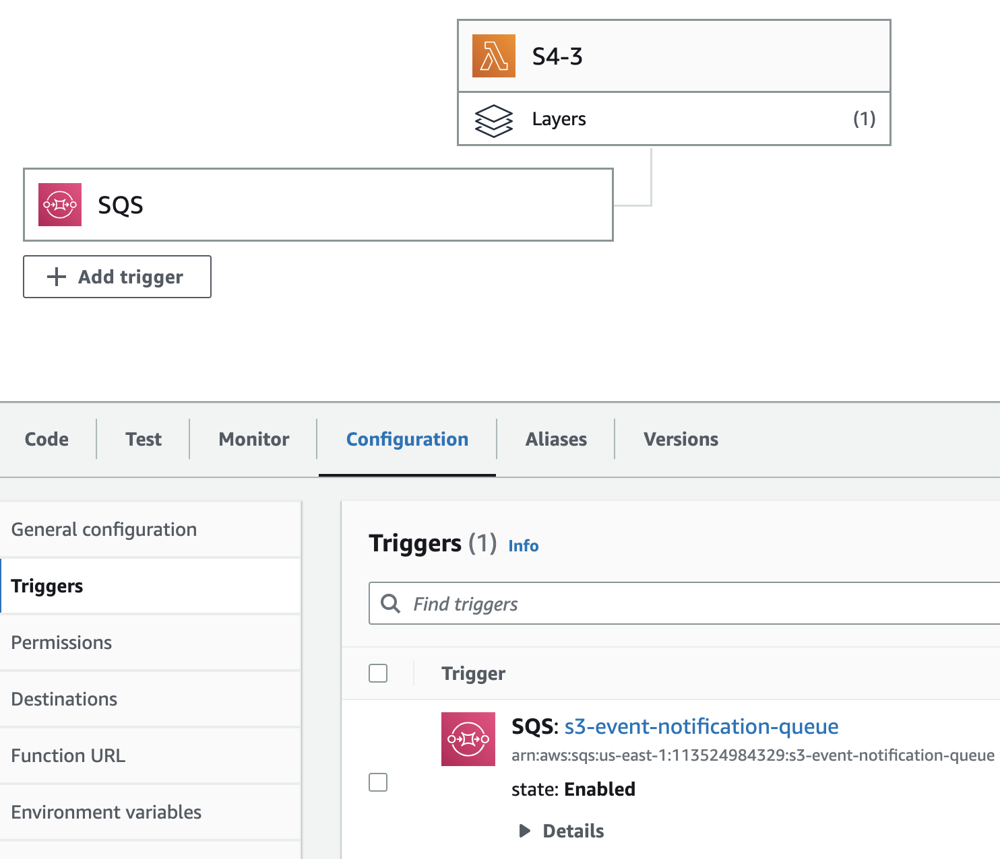
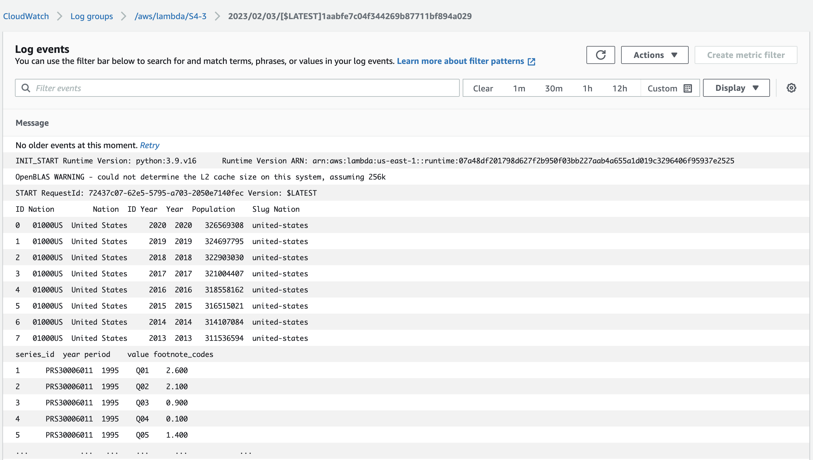

# Rearc-Quest

The quest is divided into 4 parts:

- [Rearc-Quest](#rearc-quest)
  - [Part 1 - AWS S3 \& Sourcing Datasets](#part-1---aws-s3--sourcing-datasets)
    - [AWS Setup](#aws-setup)
    - [Execution](#execution)
    - [AWS Glue - Job Schedule](#aws-glue---job-schedule)
    - [GIT - CI/CD](#git---cicd)
  - [Part 2 - APIs](#part-2---apis)
  - [Part 3 - Data Analytics](#part-3---data-analytics)
  - [Part 4 - Infrastructure as Code \& Data Pipeline](#part-4---infrastructure-as-code--data-pipeline)
    - [1. IAM User Setup by Root User](#1-iam-user-setup-by-root-user)
    - [2. IAM User Functionalities](#2-iam-user-functionalities)

## Part 1 - AWS S3 & Sourcing Datasets

This [dataset](https://download.bls.gov/pub/time.series/pr/) was uploaded to the S3 Bucket using [s3_script.py](https://github.com/shaswat-dharaiya/Rearc-Quest/blob/main/s3_script/s3_script.py).


Files can be downloaded from S3 bucket using this [page](https://s1quest.s3.amazonaws.com/index.html)

### AWS Setup

1. Run locally:

   <!-- To ease up the process, directly a root user has been created  -->

   Create an Access key (required to run the script locally) for your IAM User (We have used the root user keys for this step only).

   Add the following policies to your IAM User:
    1. AmazonS3FullAccess
    2. AWSGlueConsoleFullAccess

2. Run on AWS Glue:

    Create a new role `s3_glue_quest`:
    * Add Use case as `Glue` and click next.
    * Add following Permissions policies:
        1. AmazonS3FullAccess
        2. CloudWatchFullAccess
        3. AWSGlueConsoleFullAccess


### Execution

```python
key = "../srd22_accessKeys.csv" if environ.get('LH_FLAG') else None
bucket_name = "s1quest"
res_url = "https://download.bls.gov/pub/time.series/pr/"

s = ManageS3(bucket_name, res_url, key)
s.sync_files()
```

### AWS Glue - Job Schedule
Once we have the script running locally, we can upload it to `AWS Glue`. And schedule a job.

In Glue Studio, select `Python Shell script editor` and select `Upload and edit an existing script` and click `Create`.

Attach your IAM Role to your job.


Test run the job by clicking `Run`.


Go to `Schedules` Tab and click `Create Schedule`, type in name and select the frequency. This will keep the S3 bucket in sync with the dataset.


### GIT - CI/CD

The python script in Glue comes from `s3_script.py` file in an S3 bucket. Our aim is to automatically update that file upon `git push` done on the script.

We ceate a **SyncS3** `github actions` defined in [syncS3.yml](https://github.com/shaswat-dharaiya/Rearc-Quest/blob/main/.github/workflows/syncS3.yml) to achieve this.

It will use AWS Credentials and copy the contents of the `s3_script` folder to `script` folder in the S3:

Upon a `git push` it runs the SyncS3 job.



## Part 2 - APIs

Using the [s3_script.py](https://github.com/shaswat-dharaiya/Rearc-Quest/blob/main/s3_script/s3_script.py)'s `new_s3_add_files()` method, data from the [api](https://datausa.io/api/data?drilldowns=Nation&measures=Population) is uploaded to the S3 Bucket on AWS.

```python
new_bucket = "s2quest"
api = "https://datausa.io/api/data?drilldowns=Nation&measures=Population"
file_key = "data.json"
s.new_s3_add_files(new_bucket, api, file_key)
```


## Part 3 - Data Analytics
Implementation and output of this part is available in [s2quest.ipynb](https://github.com/shaswat-dharaiya/Rearc-Quest/blob/main/s2quest.ipynb).

This part is divided into 3 Steps:
1. Step 3.0 - Data Collection - Data from API & S3 (pr.data.0.Current)
2. Step 3.1 - Mean & Standard Deviation
   * Mean&nbsp;&nbsp;&nbsp;&nbsp;&nbsp;&nbsp;&nbsp;&nbsp;&nbsp;&nbsp;&nbsp;&nbsp;&nbsp;&nbsp;&nbsp;&nbsp;&nbsp;&nbsp;&nbsp;&nbsp;&nbsp;&nbsp;&nbsp; = 317437383.0
   * Standard Deviation = 4257090.0
3. Step 3.2 - Grouping
4. Step 3.3 - Filtering

## Part 4 - Infrastructure as Code & Data Pipeline

For this we use `Terraform` & `Github Actions` to achieve Automation of Data Pipeline + CI/CD.

Upon executing the script: [scripts/setup.sh](https://github.com/shaswat-dharaiya/Rearc-Quest/blob/main/scripts/setup.sh) following steps execute one after the other.

One change made, is use of `AWS Lambda` instead of `AWS Glue` as the former is what's asked and latter is more of an overkill in our case.

### 1. IAM User Setup by Root User
1. Using the script: [scripts/root_setup.sh](https://github.com/shaswat-dharaiya/Rearc-Quest/blob/main/scripts/root_setup.sh) and root user credentials of **srd22**, a new IAM user gets created through Terraform.
   * The user's access token is storerd to a private bucket.


1. Policies attached to that user can be seen in [TF_code/user/create_user.tf](https://github.com/shaswat-dharaiya/Rearc-Quest/blob/main/pipeline/TF_code/user/create_user.tf).
<!-- create_infra.tf -->
### 2. IAM User Functionalities
1. The User starts infastuctue setup using [scripts/setup.sh](https://github.com/shaswat-dharaiya/Rearc-Quest/blob/main/scripts/setup.sh)
   * creates 2 new buckets `s1quest` (public access) - 1 for the dataset and `s2quest` - 1 for the API using [TF_code/buckets/create_buckets.tf](https://github.com/shaswat-dharaiya/Rearc-Quest/blob/main/pipeline/TF_code/buckets/create_buckets.tf)
   * `s2quest`, The bucket with the API data will also contain code for the lambda functions (uploaded later on).



2. The code for lambda function - - `classes/ManageS3.py`, `lambda/s3_script.py` & `lambda/s2quest.py` - gets zipped up and is uploaded to `s2quest` bucket as `lambda_files.zip`.


3. Infrastructure setup
   * Access the pre-existing user role: `automate_terraform` using `rearc-user`'s acccess key.
   * Create a lamabda function: `automate_quest` that implement 1st two steps.
   * Configure an `aws_cloudwatch_event_rule` that triggers the lambda function once every day.
   * Files uploaded to *s1quest* can be downloaded from S3 bucket using this [page](https://s1quest.s3.amazonaws.com/index.html) or this [page](https://github.com/shaswat-dharaiya/Rearc-Quest/blob/main/scripts/index.html)


   * Access the `s2quest` bucket and attach an `SQS` queue such that when the `data.json` file from the API gets uploaded to the bucket, it triggers an entry into the queue.



   * Attach a lambda function: `S4-3` to the SQS queue that gets triggerd when an entry is made to the queue.





   * The outputs of both the lambda functions get logged into `CloudWatch`.




A `GitHub Action`: "LambdaSync" in the file [.github/workflows/lambdaS3.yml](https://github.com/shaswat-dharaiya/Rearc-Quest/blob/main/.github/workflows/lambdaS3.yml) syncs the S3 bucket: `s2quest` as well as in both the lambda functions upon a `git push` to the python scripts in the main branch.

The IAM user get's the [scripts/destroy.sh](https://github.com/shaswat-dharaiya/Rearc-Quest/blob/main/scripts/destroy.sh) script that will delete the entire infrastructure.


On the other hand Root User has the [scripts/root_destroy.sh](https://github.com/shaswat-dharaiya/Rearc-Quest/blob/main/scripts/root_destroy.sh) script that will delete the entire infrastructure.